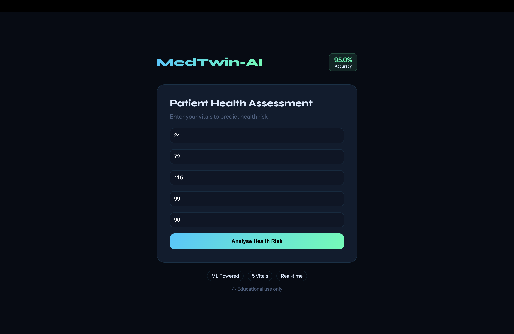
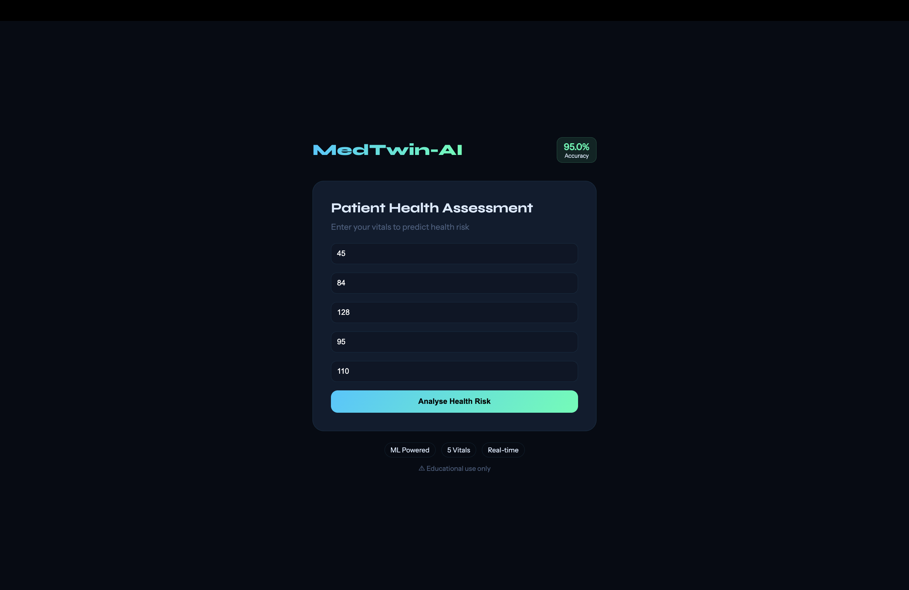
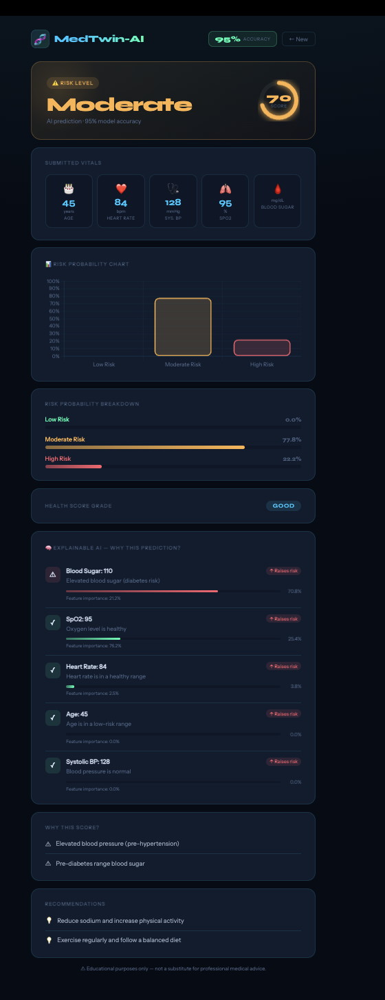
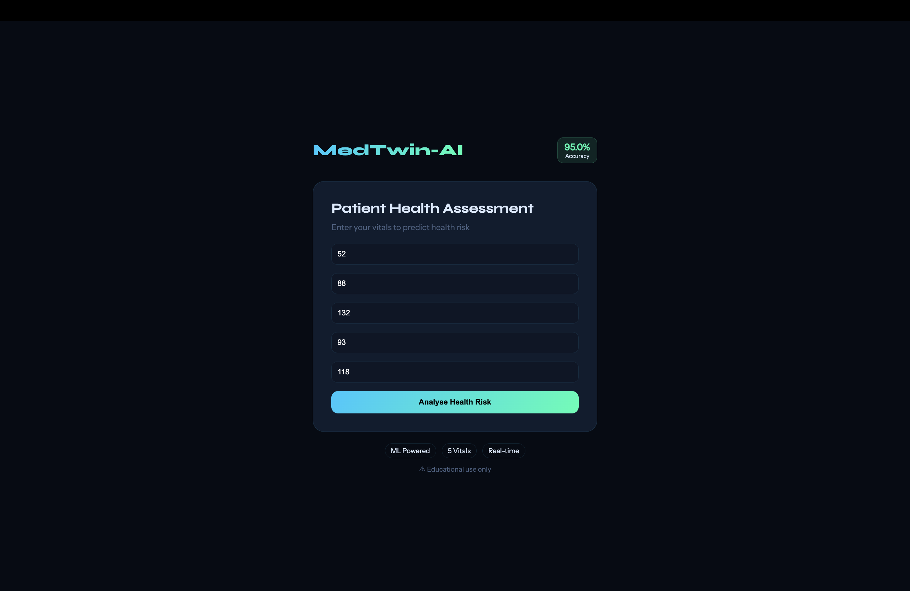
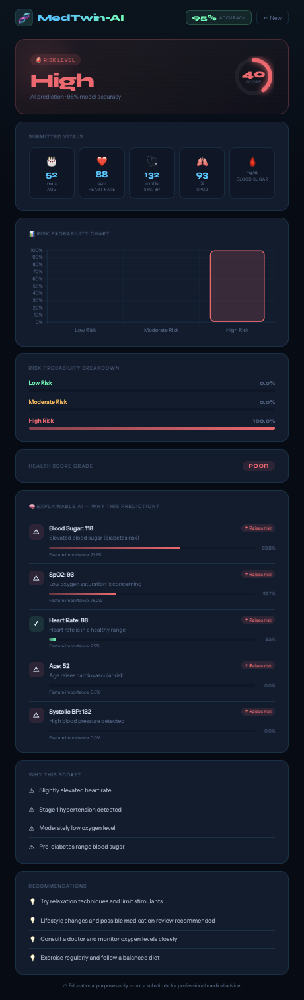

# 🧠 MedTwin-AI

<div align="center">

## AI-Powered Patient Risk Prediction System

Real-time health risk analysis using Machine Learning, Explainable AI, and interactive visualizations.


</div>

---

# 📸 Application Preview

## 🏠 Home Page

Modern patient input interface for entering health vitals.


---

## 🟢 Low Risk Prediction

### Input Case



### Output Result


---

## 🟡 Moderate Risk Prediction

### Input Case



### Output Result



---

## 🔴 High Risk Prediction

### Input Case



### Output Result



---

# 🚀 About The Project

MedTwin-AI is an AI-powered healthcare web application that predicts a patient’s health risk level using important medical vitals such as:

* Age
* Heart Rate
* Blood Pressure
* Oxygen Saturation (SpO₂)
* Blood Sugar

The system combines:

* 🌳 A Decision Tree Machine Learning model
* 📊 A health scoring engine
* 🧠 Explainable AI insights
* ⚡ Real-time Flask backend processing

The project is designed to demonstrate how Artificial Intelligence can assist healthcare analysis through interpretable and user-friendly systems.

---

# ✨ Features

* 🧠 AI-powered health risk prediction
* 📊 Probability visualization using Chart.js
* 🌳 Decision Tree-based ML model
* 💡 Explainable AI insights and feature contributions
* 📈 Health score and grading system
* ⚡ Real-time prediction engine
* 🎨 Modern responsive UI design
* 🔍 Interactive patient health analysis

---

# 🛠️ Tech Stack

| Technology          | Usage                     |
| ------------------- | ------------------------- |
| Python              | Core Programming Language |
| Flask               | Backend Web Framework     |
| Scikit-learn        | Machine Learning          |
| NumPy               | Numerical Processing      |
| HTML/CSS/JavaScript | Frontend Development      |
| Chart.js            | Data Visualization        |

---

# 🧠 System Workflow

```text
Patient Input
      ↓
Flask Backend
      ↓
Decision Tree ML Model
      ↓
Health Score Engine
      ↓
Prediction + Explainable AI
      ↓
Interactive Result Dashboard
```

---

# 📂 Project Structure

```text
MedTwin-AI/
│
├── main.py
├── model.py
├── health_score.py
├── requirements.txt
│
├── templates/
│   ├── index.html
│   └── result.html
│---assets/
├── System_Home_Page.png
├── low_risk_input.png
├── low_risk_output.png
├── moderate_risk_input.png
├── moderate_risk_output.png
├── high_risk_input.png
└── high_risk_output.png
```

---

# ▶️ Run Locally

```bash
git clone https://github.com/Heemadhawala-R/MedTwin-AI.git
cd MedTwin-AI
pip install -r requirements.txt
python main.py
```

Open in browser:

```text
http://127.0.0.1:5001
```

---

# 🧪 Example Prediction

## Input

* Age: 24
* Heart Rate: 72
* Blood Pressure: 115
* SpO₂: 99
* Blood Sugar: 90

## Output

* Risk Level: Low
* Health Score: 95
* Grade: Excellent
* Insight: All vitals are within healthy range

---

# 🌳 Why Decision Tree?

This project uses a Decision Tree Classifier because:

* It is interpretable and easy to understand
* It performs well on structured healthcare data
* It provides explainable decision-making
* It handles non-linear relationships effectively

Future versions may include Random Forest or XGBoost models for improved performance.

---

# 🚀 Future Improvements

* Integration with real healthcare datasets
* User authentication system
* Cloud database support
* Wearable health device integration
* Mobile responsiveness improvements
* Advanced ML ensemble models

---

# ⚠️ Disclaimer

This project is developed for educational and research purposes only.
It should not be considered a substitute for professional medical diagnosis or treatment.

---

# 👨‍💻 Author

## Heemadhawala R

GitHub: [https://github.com/Heemadhawala-R](https://github.com/Heemadhawala-R)

---

<div align="center">

⭐ If you found this project useful, consider giving it a star!

</div>
